<!--  -->

## Dr. Jekyll and Mr. Markdown
### Bloggen für Entwickler

Ottmar Gobrecht, Markus Dötsch

DOAG Konferenz 2017, Nürnberg

-----

## Motivation

---

### Wissen teilen

Oder zumindest bewahren :-)

---

### Schnell und unkompliziert

Hürden minimieren

---

### Bekannte Tools

Context Switches vermeiden

---

### Bloggen als Teil der "normalen" Arbeit

Nicht als extra Teil ansehen

-----

## Was ist git?

- Open Source Software zur Versionsverwaltung
- Initiator 2005 - Linus Torvalds

---

### Benutzbar in der Kommandozeile ...

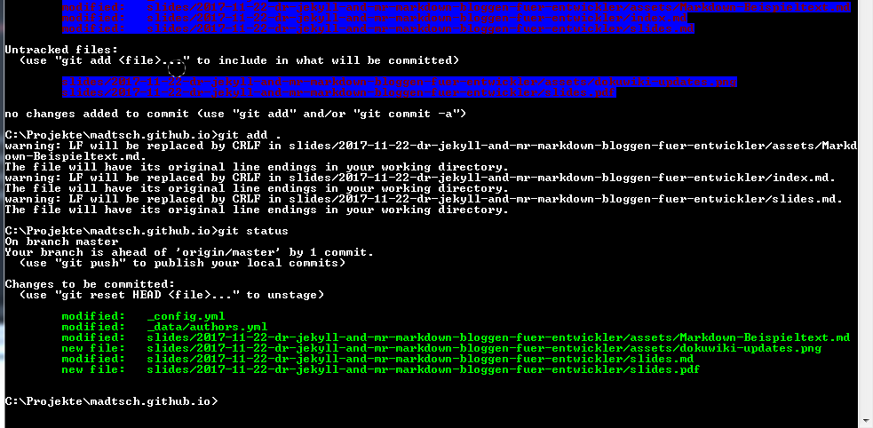  

---

### ... oder mit grafischen Tools

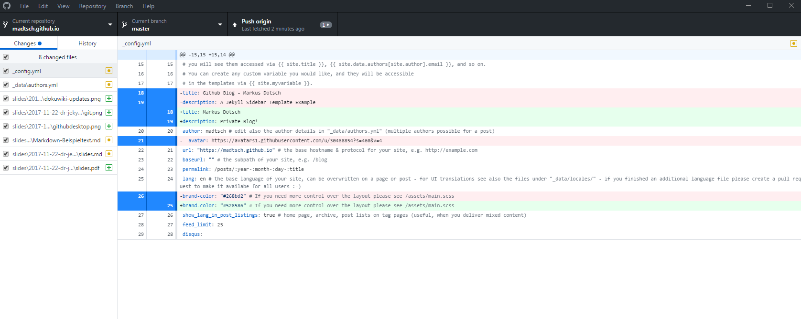  

wie GitHubDesktop oder Editoren wie Atom

-----

## Was ist GitHub?

- Webbasierter Online Dienst
- Reichert Entwicklungsprozess an
- Öffentliche Repositories/Projekte kostenfrei
- Kostenfreie Subdomain - UserName.github.io

-----

## Was ist Jekyll?

---

### Ein Generator für statische Webseiten

Genauer: Ein Ruby Skript

---

### Was soll das bringen?

---

- Geschwindigkeit
- Sicherheit
- Anpassbarkeit (übersichtlich)

---

Geschwindigkeit dynamisch - DSL

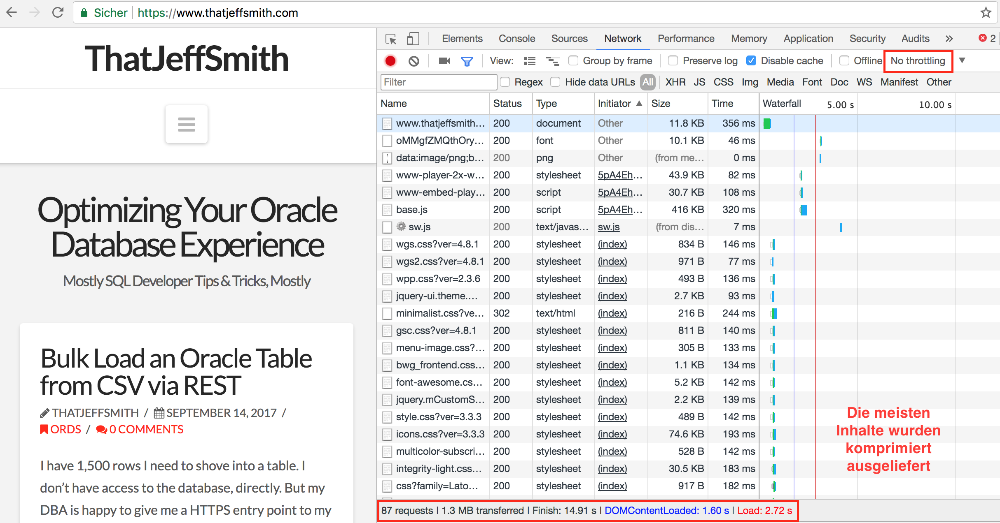  
<small>87 Requests - 1,3 MB - 2,7 s Ladezeit</small>

---

Geschwindigkeit statisch - DSL

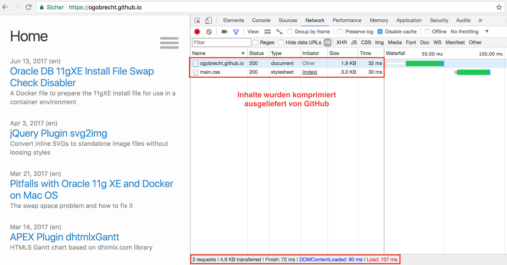  
<small>2 Requests - 5 KB - 0,1 s Ladezeit</small>

---

Geschwindigkeit dynamisch - mobil 3G

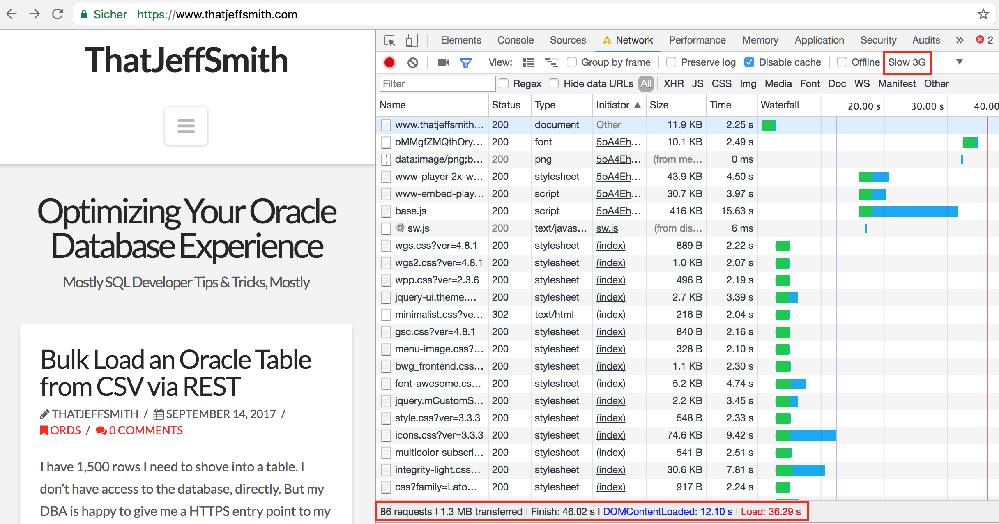  
<small>86 Requests - 1,3 MB - 36,3 s Ladezeit</small>

---

Geschwindigkeit statisch - mobil 3G

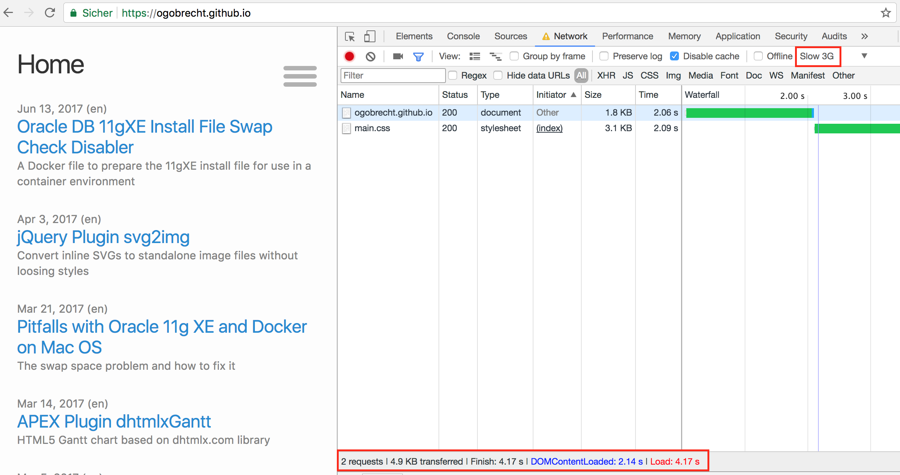  
<small>2 Requests - 5 KB - 4,2 s Ladezeit</small>

---

[Google PageSpeed Insights](https://developers.google.com/speed/pagespeed/insights/?hl=de&url=ogobrecht.github.io&tab=mobile)

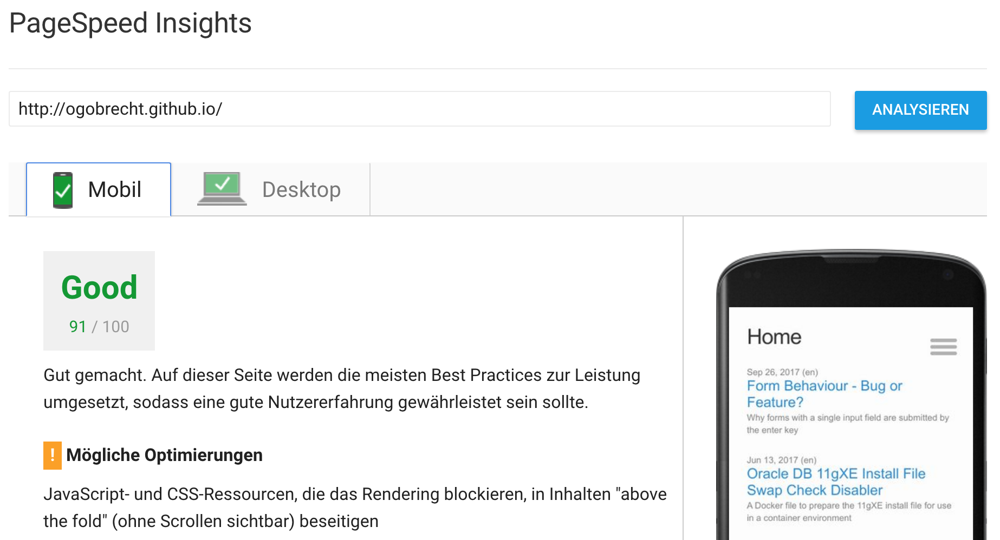

---

[Google PageSpeed Insights](https://developers.google.com/speed/pagespeed/insights/?hl=de&url=ogobrecht.github.io&tab=desktop)

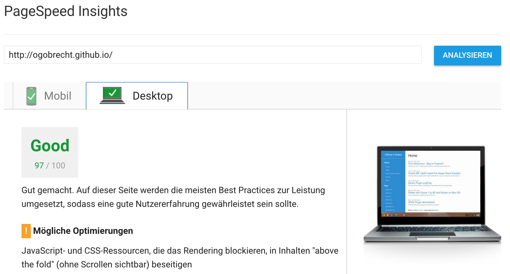

---

[Google PageSpeed Insights](https://developers.google.com/speed/pagespeed/insights/?hl=de&url=www.thatjeffsmith.com&tab=mobile)

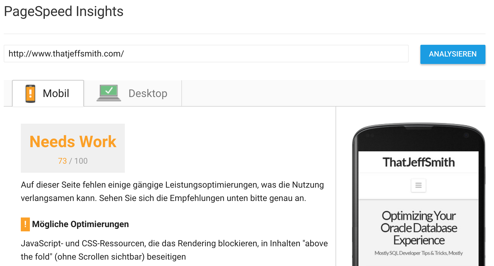

---

[Google PageSpeed Insights](https://developers.google.com/speed/pagespeed/insights/?hl=de&url=www.thatjeffsmith.com&tab=desktop)

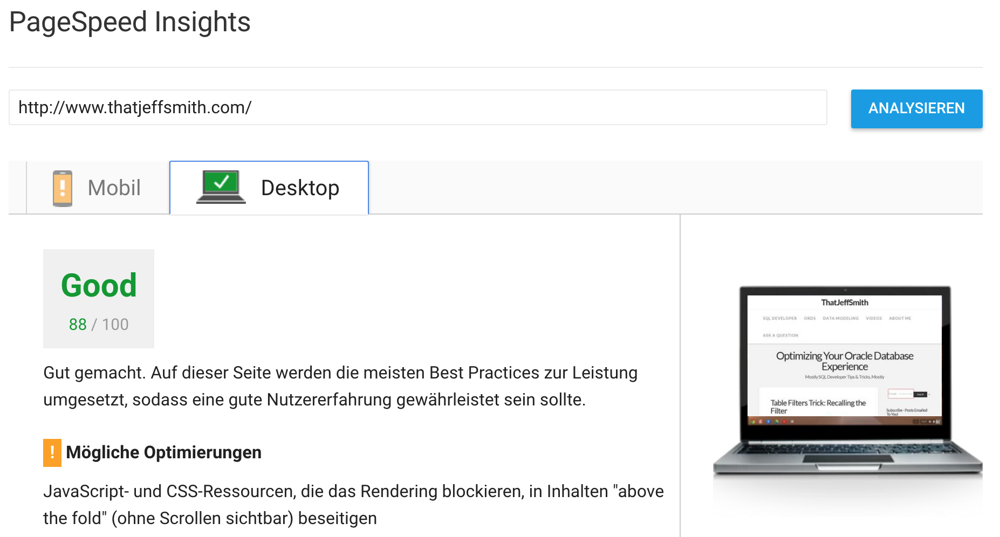

---

### Ist das sicher?

  
<small>Ein DokuWiki, das längerer Zeit nicht aktualisiert wurde...</small>

---

### Fragen?

-----

## Was ist Markdown?

---

### Eine vereinfachte Auszeichnungssprache

Vornehmlich zur HTML Erstellung

---

### Ziel

Ohne Konvertierung leicht les- und schreibbar

```markdown
# Eine Überschrift der ersten Ordnung

## Eine Überschrift zweiter Ordnung

Ein Absatz mit *kursivem Text* , **fettem Text** und
einer ***Kombination aus fett und kursiv***.

- Ein Aufzählungspunkt
- Noch einer
  - Ein Unterpunkt

[Ein Link](https://daringfireball.net/projects/markdown/syntax)

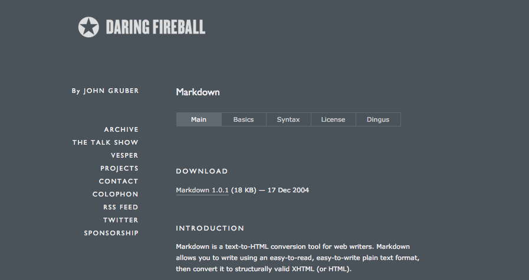
```

---

### Abgrenzung

HTML = Publikations-Format

Markdown = Schreib-Format

---

### Toolunterstützung

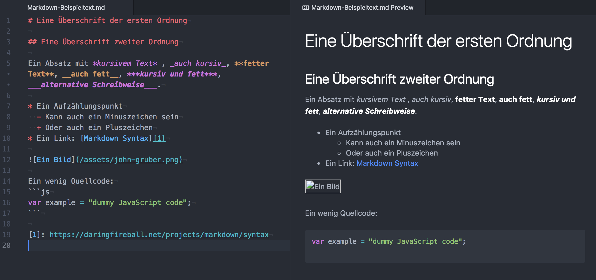

<small>Beispiel: [Editor Atom](https://atom.io/) mit [Plugin Markdown-Writer](https://atom.io/packages/markdown-writer)</small>

---

### Fragen?

-----

## Online in 5 Minuten

---

### Alles im Browser

- Login to [GitHub](https://github.com/)
- Fork repository [HydeBar](https://github.com/ogobrecht/hydebar)
- Edit `_config.yml` (url, baseurl)
- Change repository settings
  - Rename to yourUserName.github.io
  - Activate GitHub Pages

---

### Vervollständigung Konfiguration

- `_data/authors`
- `_config.yml`
  - Permalink:
    - `/posts/:year-:month-:day-:title`
    - [Jekyll Doku: Permalinks](https://jekyllrb.com/docs/permalinks/)
  - Sidebar
  - ...

---

### Fragen?

-----

## Optionale Installation lokal

Für Neugierige und "Selbermacher"

---

### Installation Git Client

- [Tutorial 1](https://git-scm.com/docs/gittutorial)
- [Tutorial 2](http://rogerdudler.github.io/git-guide/index.de.html)

---

### Installation Ruby

- [Doku Installation](https://www.ruby-lang.org/de/documentation/installation/)
- [Download](https://rubyinstaller.org/)
- Paketmanager Bundler
```sh
gem install bundler
```

---

### Installation Blog

Im (übergeordneten) Projektverzeichnis:
```sh
git clone yourForkedRepoURL.git
```

Das lokale Verzeichnis wird automatisch angelegt

```sh
cd yourForkedRepoName
bundle install
```

<small>"bundle install" installiert alle Abhängigkeiten für Jekyll, die im  
"Gemfile" konfiguriert sind - siehe Projektverzeichnis</small>

- [Doku Installation](https://jekyllrb.com/docs/installation/)
- [Doku GitHub Pages & Jekyll](https://help.github.com/articles/setting-up-your-github-pages-site-locally-with-jekyll/)


Anmerkung:

GitHub URL = `https://github.com/UserName/RepoName.git`
Beispiel: <https://github.com/Madtsch/madtsch.github.io.git>

- Windows ist von Jekyll nicht offiziell unterstützt
- Dokumentation: <https://jekyllrb.com/docs/windows/>
- Windows 10 - Integrierte Bash verwenden

---

### Starten Devserver

Automatischer Refresh bei Änderungen

```sh
bundle exec jekyll serve
```

<small markdown="1">Server ist unter <http://localhost:4000> aufrufbar</small>

Einmaliger Refresh

```sh
bundle exec jekyll build
```

---

### Publizieren der Änderungen auf GitHub

```sh
git push yourForkedRepoURL.git
```

---

### Spätere Updates von Jekyll

```sh
bundle update
```

---

### Fragen?

-----

## Inhalte Erstellen

---

### Online

- GitHub
- Trello
- One Note, Evernote, Email, ...
- Alles, was Text speichern kann :-)
- ...

---

### Demo...

---

### Offline Toolempfehlungen

- Editor Atom
  - Plugin: Markdown-Writer
- Editor Visual Studio Code
  - Plugin: Markdown All in One
- Jede gute IDE hat Plugins für Markdown

---

### Demo...

---

### Fragen?

-----

## Die Jekyll Blackbox

---

### Was ist ein Post?

- Liegt irgendwo unterhalb von `_posts`
- Namenskonvention
  - `yyyy-mm-dd-post-titel.md`
- [Jekyll Doku: Writing posts](https://jekyllrb.com/docs/posts/)

---

### Was ist eine Page?

- Alles, was kein Post ist
  - Also, nicht zeitbasiert
  - Statische Seiten eben ;-)
- [Jekyll Doku: Creating pages](https://jekyllrb.com/docs/pages/)
- [Jekyll Doku: Static files](https://jekyllrb.com/docs/static-files/)

---

### Frontmatter?

- Die Metadaten von posts und pages
- [Jekyll Doku: Front Matter](https://jekyllrb.com/docs/frontmatter/)

```yaml
---
title: Dr. Jekyll and Mr. Markdown - Bloggen für Entwickler
subtitle: DOAG Konferenz 2017, Nürnberg
categories: [slides]
tags: [jekyll, markdown]
author: [ogobrecht, madtsch]
lang: de
last_modified_at: 2017-11-12
---

Hier kommt dann der eigentliche Artikel...

```

---

### Verzeichnisstruktur

```
.
├── _config.yml
├── _data
|   └── members.yml
├── _drafts
|   ├── begin-with-the-crazy-ideas.md
|   └── on-simplicity-in-technology.md
├── _includes
|   ├── footer.html
|   └── header.html
├── _layouts
|   ├── default.html
|   └── post.html
├── _posts
|   ├── 2007-10-29-why-every-programmer-should-play-nethack.md
|   └── 2009-04-26-barcamp-boston-4-roundup.md
├── _sass
|   ├── _base.scss
|   └── _layout.scss
├── _site
├── .jekyll-metadata
└── index.html # can also be an 'index.md' with valid YAML Frontmatter
```

[Jekyll Doku: Directory structure](https://jekyllrb.com/docs/structure/)

---

### Posts & Pages verlinken - erster Blick auf Liquid

Markdown Link Syntax & Liquid Tag "link"  
<small markdown="1">`{{ site.baseurl }}` ist je nach Konfiguration optional</small>

```md
[Link to a post]()
[Link to a page]({{ site.baseurl }})
[Link to a file]()
```

Nur mit Markdown...

```md
[Link to a post](/posts/2016-07-26-name-of-post.html)
[Link to a page]({{ site.baseurl }}/news/index.html)
[Link to a file](/assets/doc.pdf)
```

Wo ist der Unterschied?  
<small>"link" Tag sorgt für korrekte Permalinks! [Jekyll Doku: Links](https://jekyllrb.com/docs/templates/#links)</small>


---

### Demo...

---

### Fragen?

-----

## Jekyll selbst erweitern

Beispiel: [Reveal.js](http://lab.hakim.se/reveal-js/) Integration

<small>Was uns hilft: Jekylls Übersichtlichkeit und Anpassbarkeit</small>

---

### Die Grundlage Liquid

Jekylls Template Engine

- Layouts (kaskadierende Templates)
- Includes (Funktionsaufrufe)
- [Jekyll Doku: Templates](https://jekyllrb.com/docs/templates/)
- [Liquid Template Language](https://shopify.github.io/liquid/)

---

### Demo...

---

### Warum Reveal.js?

- Slides HTML5 basiert
- Touch Support für mobile Geräte
- Unterstützt Markdown
- [Reveal.js Doku](https://github.com/hakimel/reveal.js)

---

### Was brauchen wir?

- Layout für Reveal.js
- Include zur Einbindung in Posts
- Eine Markdowndatei für Folieninhalte
- Die Reveal.js Library Files

---

### Ideen zur Umsetzung

- Ein Ordner pro Präsentation
- `index.md` für Reveal.js
- `slides.md` für Folieninhalte (ohne Front Matter)
- Reveal Libs in `/assets/reveal.js`
- Include mit Variable `path`

---

### Demo...

---

### Fragen?

-----

## Links

---

### Weitere Jekyll Themes/Templates

- Mit ["Fork Quick Start"](https://github.com/barryclark/jekyll-now#other-forkable-themes)
- [Step by Step Anleitung](http://jmcglone.com/guides/github-pages/)

---

### Weitere Static Site Generators

- [Hugo](https://gohugo.io/) (Go)
- [Hexo](https://hexo.io/) (Node.js)
- [Gatsby](https://www.gatsbyjs.org/) (Node.js, React)
- [Pelican](https://blog.getpelican.com/) (Python)
- ...
- [Top Ten Liste 2017](https://www.netlify.com/blog/2017/05/25/top-ten-static-site-generators-of-2017/)
- [Übersicht nach Beliebtheit](https://www.staticgen.com/)

---

### PL/SQL Template Engines

- [FTLDB](https://github.com/ftldb/ftldb/blob/master/README.md)
- [tePLSQL](https://github.com/osalvador/tePLSQL/blob/master/README.md)

---

## The End

### Fragen?

[ogobrecht.github.io](https://ogobrecht.github.io)

[madtsch.github.io](https://madtsch.github.io)  

<!--  -->
